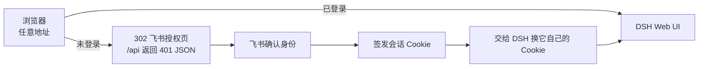

# @jianghuifr/dsh-feishu-auth

给 [DeepSeek Harness](https://github.com/deepseek-ai/deepseek-harness)（`dsh`）的 Web 界面加一道**飞书登录**：没通过飞书登录，首页、静态资源、`/api` 全拿不到。

## 为什么需要它

DSH 本身没有服务器级认证。把 Web 界面通过局域网、端口转发、反代或隧道暴露出去的那一刻，**任何能连上这个地址的人都能操作你的 agent**——读写工作区文件、执行命令、消耗你的 API key。

这个插件把「能不能进来」变成「在飞书里能不能登录」：

- 保护**你实际访问的那个地址**（LAN IP / 隧道域名 / localhost，任意端口），不用为每个地址单独配置；
- 登录源就是飞书应用的**可用范围**——谁能用这个应用谁就能进，撤权在飞书后台一次搞定；
- 拿不到凭证时**拒绝一切访问**（故障关闭），不会悄悄退化成「没保护」。



## 三步上手

**1. 飞书后台登记回调地址** — 开发者后台 → 你的应用 → 安全设置 → 重定向 URL，添加一条：

```
<你访问用的地址>/feishu-auth/callback
```

例如 `https://xxx.trycloudflare.com/feishu-auth/callback`、`http://192.168.1.23:3080/feishu-auth/callback`。不支持通配符，最多 300 条；访问地址变了要补一条（临时隧道重启换域名就是这种情况）。

**2. 放凭证** — 写进 `~/.dsh/.env`（`chmod 600`）：

```sh
FEISHU_APP_ID=cli_xxxxxxxxxxxxxxxx
FEISHU_APP_SECRET=xxxxxxxxxxxxxxxxxxxxxxxxxxxxxxxx
```

**3. 激活并启动** — 从 npm 安装（推荐）：

```sh
dsh plugin --profile web add @jianghuifr/dsh-feishu-auth
dsh web --no-open --host 0.0.0.0 --port 3080 --trusted-host <你的隧道域名>
```

装完后 profile 的 `dsh.profile.bundles` 会多一行，启动日志出现 `飞书登录已挂载` 和 `网关自检通过` 就绪。

> 想跑本地源码（要改代码、或离线环境）？手工放一份仓库到 `~/.dsh/plugins/dsh-feishu-auth/`，再照 [AGENTS.md 的安装与激活](AGENTS.md#安装与激活) 在 profile 里插一行。tarball 离线安装用 `dsh plugin ... add ./dsh-feishu-auth-0.1.0.tgz`。

权限（scope）不用申请，`open_id`、`union_id`、`tenant_key`、姓名直接可读。

## 配置

写在插件行的 `config:` 下，共 4 项：

| 配置 | 默认 | 说明 |
| --- | --- | --- |
| `appId` / `appSecret` | 环境变量 | 缺省读 `FEISHU_APP_ID` / `FEISHU_APP_SECRET`；两者都拿不到时**拒绝一切访问** |
| `allowedUsers` | `[]` | 留空 = 放行「能使用本应用的任意飞书成员」；填了就只放行列出的 `open_id` / `union_id` / `user_id` |
| `sessionMaxAgeDays` | `14` | 会话有效期（天） |

`allowedUsers` 该填什么：被拒的人会在页面上看到**他自己**的 `open_id`，抄进去保存即可——配置项热生效，不用重启。

## 退出登录

**设置面板右上角有一个「退出登录」**（`关闭` 按钮左边）。它调 `/feishu-auth/logout`，会清掉本插件的会话 Cookie **和** harness 自己的 `dsh-auth-*`——后者是关键，只清前者的话 harness 会立刻把人放回去。

标签页停在旧的 harness 报错页上时，按一次刷新即可恢复：网关会自己把浏览器接回来（同站重进 → 必要时换一份新凭据），**不需要重新登录**。

## 常见问题

| 现象 | 处理 |
| --- | --- |
| 所有请求 503「未就绪」 | 进程环境里没有凭证。确认 `~/.dsh/.env`，然后重启 |
| 飞书报 `redirect_uri unmatch` | 回调地址没登记，或与当前访问地址不一致（隧道换域名了？） |
| 飞书报 `20010` | 该账号不在应用可用范围内，或应用版本未发布 |
| 换了地址要重新登录 | 正常：Cookie 按来源隔离，https 隧道与 `http://127.0.0.1` 各算一处 |
| 被自己关在门外 / 想彻底回退 | 用 `disable.patch.yml` 启动一次（见下），或给那行加 `disabled: true` 后重启 |

临时停用（凭证写错、飞书挂了、改错配置把自己锁在外面）—— `--patch` 收的是**路径**，所以指向你实际装的那一份：

```sh
# 从 npm 安装的（推荐）：包在 profile 的 node_modules 里
dsh --profile web --patch ~/.dsh/profiles/web/node_modules/dsh-feishu-auth/disable.patch.yml \
    --no-open --host 0.0.0.0 --port 3080

# 本地源码跑的
dsh --profile web --patch ~/.dsh/plugins/dsh-feishu-auth/disable.patch.yml \
    --no-open --host 0.0.0.0 --port 3080
```

overlay 里只有 `- id: feishu-auth` + `disabled: true`，按 id 覆盖组合包自带的那一行，所以**与代码从哪加载无关**；需要路径的只有 `--patch` 自己。

## 文档

- [AGENTS.md](AGENTS.md) — 面向 agent 与维护者：安装激活、运维速查、开发约束、改动流程
- [docs/architecture.md](docs/architecture.md) — 内部设计：拦截层、两段式交接、Cookie 与会话、失败模式
- [docs/release.md](docs/release.md) — 分发形态、CI 与发版流程

MIT
