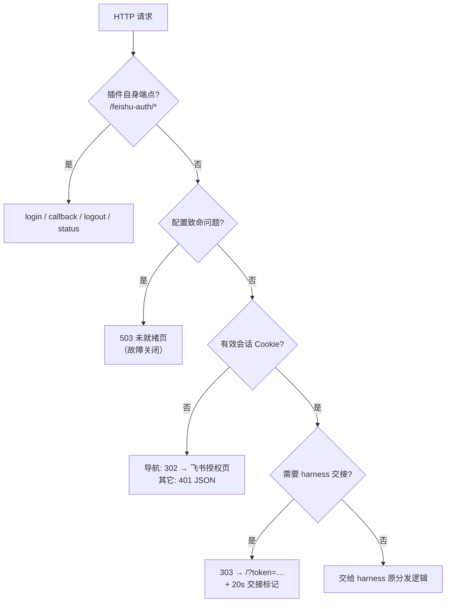
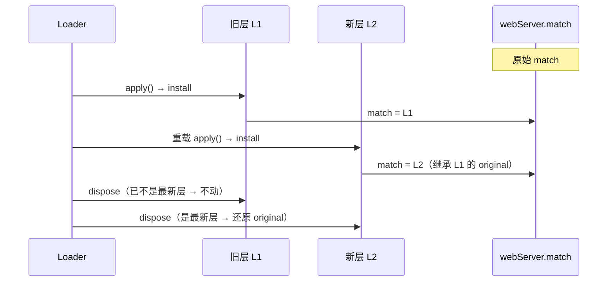
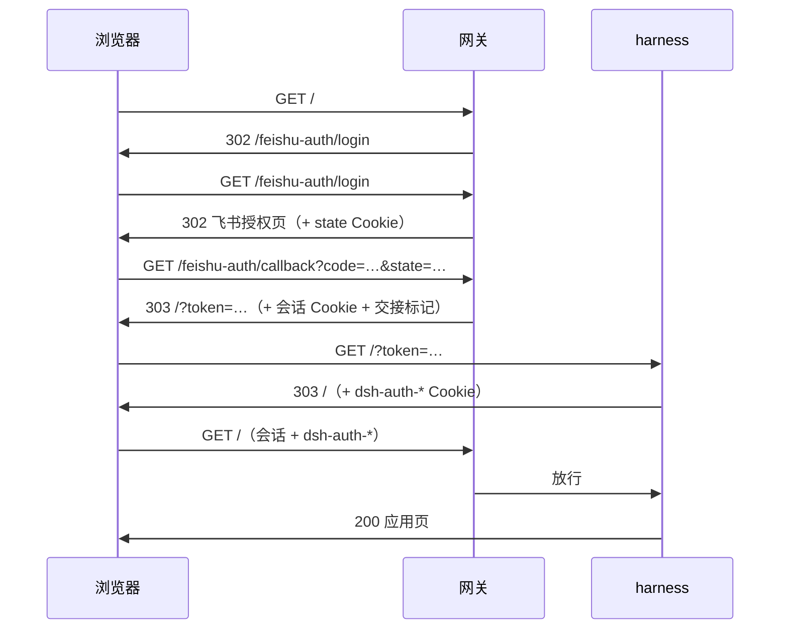

# 架构

[dsh-feishu-auth](../README.md) 的内部设计。面向要改 `lib/` 的人；运维与开发流程见 [AGENTS.md](../AGENTS.md)。

## 全景

一个 Cordis 插件，在插件挂载时替换运行中 `webServer` 服务的 `match(pathname)` 分发点，之后每个 HTTP 请求都先经过网关判定：



「需要 harness 交接」的判定：`GET/HEAD` 导航请求、路径是 `/`、URL 上没有 `token` 参数、请求里没有 `dsh-auth-` 开头的 Cookie，且没有交接标记（见下）。

## 拦截层

### 为什么是 monkey-patch

dsh 当前没有请求级中间件缝隙——`/api` 前缀被 `client-connection` 占用、RPC 拦截器拿不到 headers/cookie/socket、WebSocket 升级不走 HTTP 路由表。要「拦下所有请求」只能替换 `webServer` 的分发点。这是本插件最脆的一处依赖，找不到该分发点时**拒绝启动**而不是静默放过。

### 层的身份与幂等卸载

`ctx.webServer` 是 Cordis 的 traceable 服务，**函数值成员每次读取都返回一个新的包装 Proxy**（`createShadowMethod`），所以：

- `server.match === 自己装的函数` 恒为 false，身份比较式的卸载守卫会静默失效，层永久粘住；
- 但写入是生效的（proxy 的 set 落到真实实例），拦截本身工作正常。

因此层的识别靠**挂在函数对象上的符号标记**（键 `Symbol.for('dsh-feishu-auth.dispatcher')`，值里存真正的原始实现），当前层按**原始服务实例**（`server[Symbol.for('cordis.original')]`）记录在模块级 WeakMap 里。三条规则：

1. 安装时若分发点已带本插件标记（历史残留层），复用它的 `original`，不再往上叠；
2. 卸载时只在自己仍是最新层、且仍位于最外层时才还原；
3. 中途出现的第三方包装不会被误拆。

热重载的实测顺序是**新层先挂、旧层的 disposer 后跑**，规则 2 就是为了这种情况：



## 两段式交接

飞书登录只签发本插件自己的会话 Cookie。harness 另有一层签名 Cookie（`dsh-auth-<authority>`），只在一个**根请求带上本进程启动令牌**时签发。所以「能打开页面」需要两段都完成：

1. 网关把浏览器跳到 `connection.authenticatedUrl()` 给出的 `/?token=<launch token>`；
2. harness 校验令牌、下发 `dsh-auth-*`，再跳回干净的 `/`。

`connection` 服务**只能**经 `ctx.inject(['connection'], cb)` 取（`ctx.get` 返回 undefined，属性访问直接抛错），所以在插件挂载时捕获成 `entryUrlProvider`，每次请求时调用。取不到时打一行 error，并在交接判定里退化为直接放行给 harness（让它自己的 401 页成为终点，避免无休止往返）。

**交接标记**（`dsh-feishu-handoff`，20 秒）是死循环的兜底：浏览器拒绝存 harness Cookie 时，`/` 与 `/?token=…` 之间只会来回一次。



## Cookie 与会话

三个 Cookie，都在 `/` 路径下、`SameSite=Lax`、`HttpOnly`；`Secure` 跟随当前请求的 scheme（https 隧道加，本地 http 不加）：

| Cookie | 生命周期 | 内容 |
| --- | --- | --- |
| `dsh-feishu-session` | `sessionMaxAgeDays`（默认 14 天） | `kind=session`、`sub`（open_id）、`name`、`tenant`、`iat`、`exp` |
| `dsh-feishu-state` | 10 分钟 | `kind=state`、`nonce`、`next`、`redirectUri`、`iat`、`exp` |
| `dsh-feishu-handoff` | 20 秒 | 交接标记，防往返 |

载荷统一是 `v1.<base64url(JSON)>.<base64url(HMAC-SHA256)>`，签名密钥是 `$DSH_HOME/feishu-auth/session-secret`（首次启动生成 32 字节、0600、原子写入；重启不变，所以登录态能跨重启存活）。校验用 `timingSafeEqual`，`state` 用常量时间比较防 CSRF。

被拒的账号会看到**他自己**的 `open_id`（便于运维填 `allowedUsers`），不泄露他人信息；所有插值经 `escapeHtml`。

## 失败模式

| 情形 | 行为 |
| --- | --- |
| 缺 `appId` / `appSecret` | 故障关闭：所有请求 503「未就绪」页，日志 `[error]` 说明缺什么 |
| 会话密钥文件不可读写 | 同上（内存里用临时密钥，重启即失效） |
| `webServer.match` 不存在 | 挂载抛错，插件拒启动——无保护状态不允许运行 |
| `connection` 服务取不到 | 记 error，交接退化为放行给 harness 的 401 页 |
| 启动自检失败 | `[error]` 明确报出：未登录请求未被拦，或持有效会话仍被拒 |
| 配置项（`allowedUsers` / `sessionMaxAgeDays`）非法 | `allowedUsers` 非法 → 致命（避免悄悄放宽到全员）；`sessionMaxAgeDays` 非法 → 回落默认值 |

自检做两件事：向自己的监听端口发一个未登录探针（必须被拦：302/401/403/503 之一）和一个自签会话探针（必须放行）。

## 配置与生效路径

`analyzeConfig(raw)` 是唯一入口，返回 `{ config, fatal }`；`Config`（standard-schema）只是把它包给 loader。`fatal` 非空即进入故障关闭模式。

生效路径两种：`appId`/`appSecret` 走环境变量（启动时读取，改完必须重启）；`allowedUsers`/`sessionMaxAgeDays` 写在 profile patch 行里，patch 层是 live 重载，保存即生效。

本包以**组合包**分发：`package.json` 的 `dsh.bundle.patch` 指向 `cordis.patch.yml`，安装后这一层负责插入插件行。用户 profile 自己的 patch 层在组合包层之后应用，可以按 `id` 覆盖它（替换整行 `config`，不是深合并）。

## 模块与依赖方向

```
index.js ──► gate.js ──► urls.js ──► (node builtins)
    │           ├──► session.js
    │           ├──► feishu.js ──► urls.js
    │           ├──► pages.js
    │           └──► config.js
    └──► config.js / session.js
```

`urls.js`、`config.js`、`session.js` 是纯函数模块（易测）；`gate.js` 持有请求处理与拦截状态；`index.js` 只做装配、自检与 harness 服务解析。

## 已知边界与风险

- **WebSocket（`/api/remote.mux`）不在拦截范围**：网关只拦 HTTP。升级请求由 harness 自己校验它签名的 Cookie，而那个 Cookie 只有走完飞书登录才拿得到——属于间接保护。
- **`X-Forwarded-For` 未校验**：日志里的 `from <ip> via <socket>` 前半段可被直连方伪造。它只是审计信息，不参与任何放行判断。
- **没有公开路径白名单**：任何非插件端点都要登录。需要 webhook 之类的免登录路径时要新增配置项。
- **地址变了要重新登录**：会话 Cookie 按来源隔离，https 隧道与 `http://127.0.0.1` 各算一处。
- **回调地址不随隧道漂移**：临时隧道换域名后必须在飞书后台补登记，否则 `redirect_uri unmatch`。
- **dsh 版本耦合点**：`webServer.match` 分发点、`connection` 服务的获取方式、`dsh-auth-` Cookie 前缀、`/?token=` 兑换约定。升级 dsh 后优先复核这四处（见 [AGENTS.md](../AGENTS.md#与-dsh-版本的耦合点)）。

## 测试策略

`node --test`，零依赖。三个层次：

- **纯函数**：`session`（签名、篡改、过期、base64url 规范化）、`urls`（Host 规范化、开放重定向、导航判定）、`feishu`（两个响应形态、错误分支）。
- **网关端到端**：用替身 server/req/res 走真实分发路径——拒绝策略、登录跳转、回调（含 state 不匹配、拒绝名单、上游失败）、交接判定、登出。
- **拦截层语义**：替身模拟 Cordis「每次读返回新 Proxy」的服务形态，锁住「代理形态下可卸载」「重载顺序」「遗留层收敛」三条不变量。

改拦截层或交接逻辑时，新增用例要先在旧实现上跑红，确认它真的锁住了行为。
